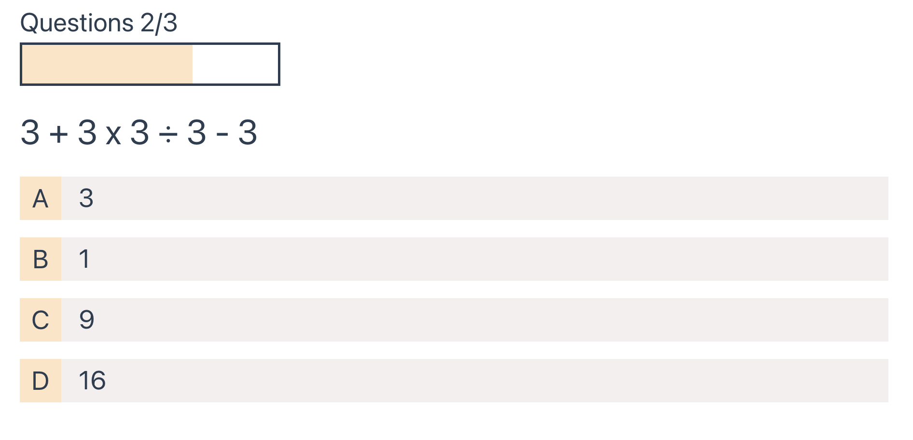

# QuizzApp (project 3/3)

A pet project to learn Vue3 framework.

Highly recommended tutorial from [LatihAcademy] (https://www.youtube.com/watch?v=I_xLMmNeLDY)  
It teaches you how to build app from scratch with vue3 newest composition api.
Tutorial starts with component in project 1 until _event_ in project 3.

Points that i learn:
1. Lots of interesting css styling :)
2. Router.
3. Event (to solve child to parent element comunication)

## ScreenShot





## Project Setup

```sh
npm install
```

### Compile and Hot-Reload for Development

```sh
npm run dev
```

### Compile and Minify for Production

```sh
npm run build
```
